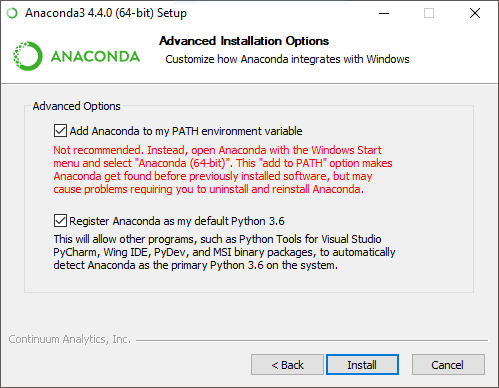

# Hướng dẫn cài python và các thư viện cần thiết

## Cài Anaconda Python
Tải Anaconda Python 3.6 tại [đây](https://www.continuum.io/downloads).

### Windows
Sau khi tải về chạy file `.exe` để chạy cài đặt. Lưu ý, chọn tùy chọn `Add Anaconda to my PATH enviroment variable`.


### Linux
Sau khi tải về được file đuôi `.sh`. Chạy lệnh:
```bash
bash Anaconda3<version>.sh
```
Khi chương trình hỏi có thêm vào file `.bashrc` không thì chọn `Yes`.
Sau khi cài đặt xong gõ lệnh sau để cập nhật biến môi trường:
```bash
source ~/.bashrc
```

## Cài OpenCV
Mở terminal gõ lệnh sau:
```bash
conda install -c conda-forge opencv
```